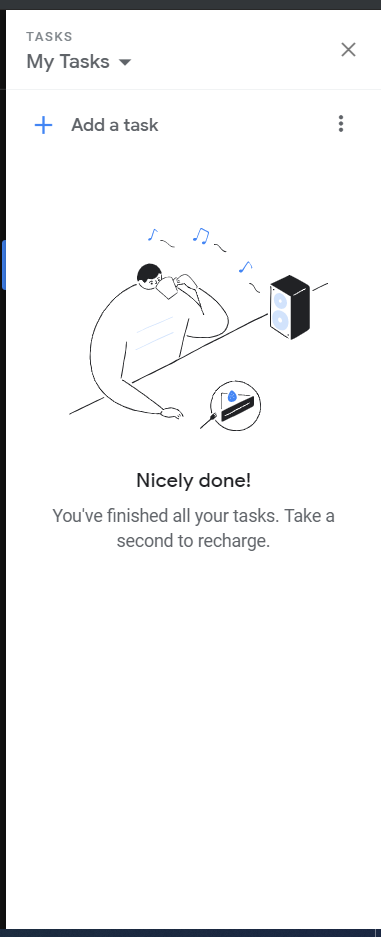
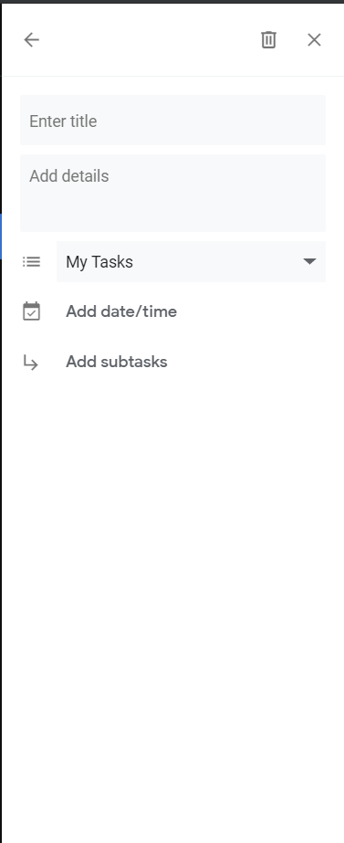
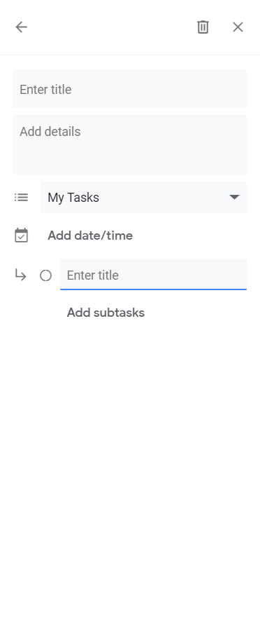
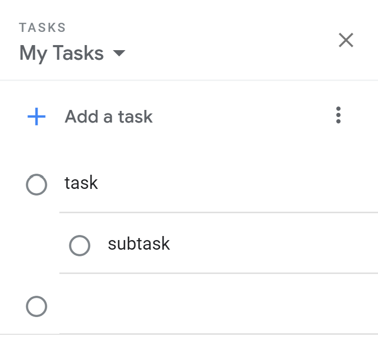
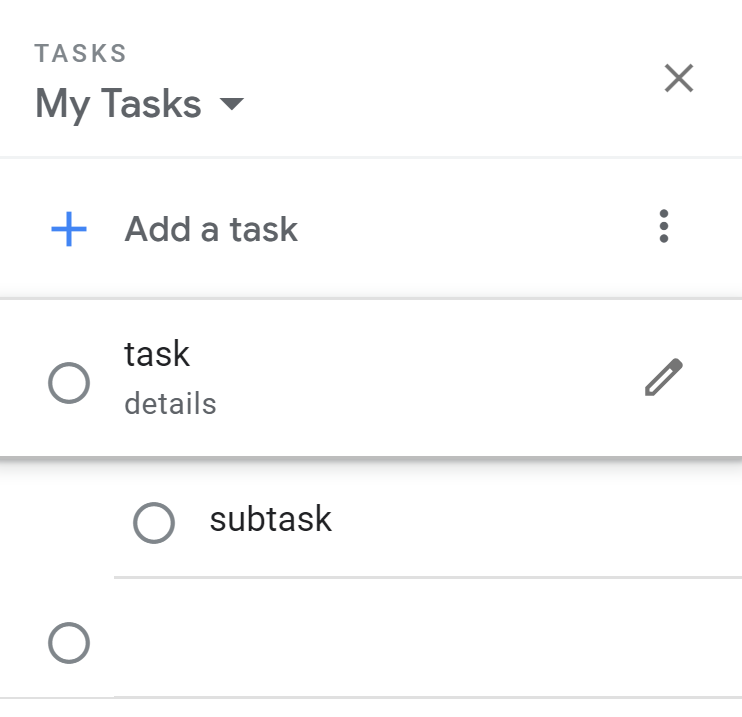
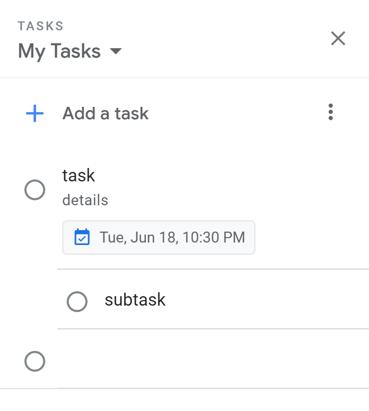
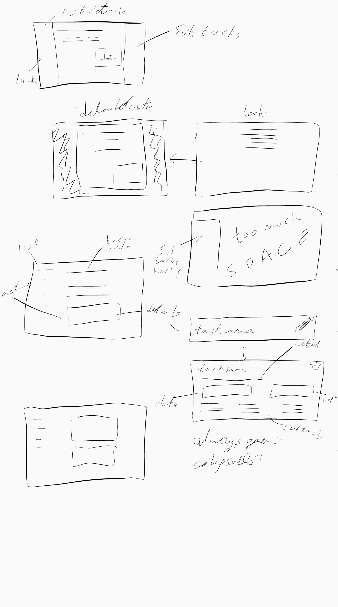
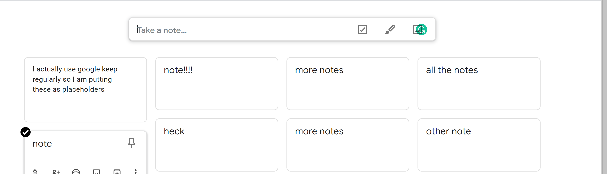
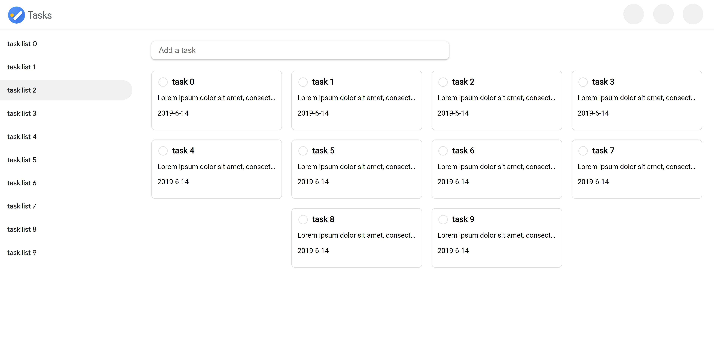

# Google Tasks Redesign

## Preface
About 5 months ago I discovered the Google tasks app. I am a massive fan of the new style they are going for and wanted to use it as my todo app for a while. However there were a few issues I had with it such as the lack of reoccurring events. However more pressingly there was no desktop app. I am someone who works constantly on a desktop or laptop and I do not typically like to have my phone with me when working, furthermore I do not like distractions thus the mixed application style Google has started making with tasks off to one side and gmail or Google calendar in focus does not work for me. So the lack of a way to access google tasks independently of anything else was the last nail in the coffin. Which is a real shame because this app looks beautiful.

---

## Problem
I really love the phone app, it is beautiful, incredably nice to use, and I could gush about it for years. I decided to make this application as though I worked at Google. There already exists [at least one](https://github.com/KarafiziArtur/react-google-tasks) webapp interface for Google tasks however it does not follow material 2.0 design system.

---

## Goals & Solution
My primary goals for this project are to buff my portfolio, and learn. This is a relatively large endevor due to the fact that I have very little time to work on this so the timeframe is undefined however by the end of it I want to have a fully functional desktop alternative to Google tasks that feels like Google could have made it.

---

## Discovery
On loading the app (viewed from gmail) you are greeted with this:

I am going to go ahead and assume that the lack of any greeting was due to the my previous expirements with this app. This shows a nice illustration with very clear actions a user could take:

* add a task
* close the sidebar (this is still gmail)
* show a dropdown of the all lists a user has.
* get more options.

This is incredibly simple by design.

Adding a task does a little animation to transition from wide sholdered cake man to a functional application. A simple text box in which to add a task is shown with the hallmarks of a "task item" such as the unchecked circle and editing menu button.

Upon clicking this button you are taken to this page that shows all the options you are given to provide more context to your task. Once again I note the simplicity of this design. Nothing is too overbearing, just 2 simple text fields, a dropdown, date picker, and a way of creating subtasks.

When creating a subtask the "task item" ui theme is kept consistent.

This is the same component with a few noticeable changes: 
* there is no edit menu
* there is a helpful little arrow
* there are two small breaks in the circle at lower resolutions
    I am not sure if this is intentional or simply a rendering glitch as it only shows when my monitor is in 1080p. I am going to treat it as such

When returning to the main menu the subtask is shown nested below the parent task.

When adding details to the parent task those are also shown in the task list.

When adding a date to the task that is also shown.

At this point there is quite a bit of data shown here and it is still not really overwhelming and easily scanable. But this is about it for this app. This is the meat of what it does. There are several other features such as keyboard shortcuts that improve the poweruser's expirence. However this is really most of it.

---

## sketches

Typically the next step would have been to identify user personas, and other such planning phases. However my goal was not to redesign google tasks, it was to recreate the mobile version for desktop. So I do not want to add any extra features (despite there being a few that I would really like.) So knowing this I jumped straight to some brainstorming.

In this process I came accross a few things of note: first is that due to the amount of data being displayed, a desktop version of this application is really unnecessary. I found this when doing some of the first drafts, I took the approch of every other desktop todo app on the planet, a list to the left with details in the main container. This is not ideal, as it looks like and behaves just like the gmail version except it can show the main task list at the same time. Next I tried moving the task list to the center, and having a detail popup, once again this struck me as shockingly similar to the original design. However this gave me an idea, in the original application the concept of a "task item" was a unifying feature. So I thought about constructing this into both the task and the details. The primary advantage to having a desktop design is screen realistate. So what if I expanded the task item into a more detailed view. Then I realized that I can simply always show details while having the list layed out similar to Google keep

Now each task could be a task that could be minimized. This allows for a simple overview of your tasks and a space effective design. Alternately I could make it as tasks are minimized by default, however I believe that will come in higher fidelity prototypes.

---

## low fidelity prototype

I prefer to use raw html to create low fidelity prototypes and wireframes. I find it extremely easy to see what I am doing and there is the benefits of being able to resize the page, and provide very simple interactions. This is a somewhat controversial point of view however I must stress I am not creating the website, or even the foundation to the website, infact this will have absolutely no functionality, I simply want to get a feel for the layout.

[The wireframe](https://s.codepen.io/Alexa42/debug/pXjrZq/VGkWNwmPobjA)

Obviously there is *a lot* wrong with this. Primarily the issues consist of the jaring transition between showing details of a task and them being hidden. Furthermore the grid system really needs to be more robust. However it gets across the general idea I am going for: a header with all of the standard Google things, a sidebar with task lists, and the tasks front and center.

---

## high fidelity prototype

Next comes my favorite part: making it all look pretty. Because I am designing this not only following the material 2.0 guidelines, but also attempting to look as though Google created this app. Thus their specific imagining of material 2.0 is what I will be attempting to recreate.

[link](https://s.codepen.io/Alexa42/debug/zVvEZK/VJrxxVBeqDyr)

There are several things of note here, firstly I am using Product Sans as the font instead of Google Sans, next there is no actual data going in here, it is just static html with styles. So the problem of the jaring transition between the non-detailed and detailed view still exists. However this represents what I had in my head when designing the wireframe.

---

## Final prototype

I could just leave it here, this helped my design skills quite a bit and I am very happy with the result. However I would like to make this into a fully functional applicaiton. So because I have no self control and this sounds fun I am going to do that.

### Tech stack

Typically I would use react for this kind of thing because it is simple, easy, and I already know it. ~~However because I am doing this as though I am a Google engineer I will instead be using [polymer](https://www.polymer-project.org/). A technology I have never used before and only know by name and that Google uses it.~~ Actually I am just going to use vue because I want to actually make this, and while I do intend to learn polymer at some point, I do not believe this is the project to do it. Instead I will be using [vue](https://vuejs.org/) because I still don't really know it that well, but I am at least familiar with it.

---

# Creating the App

Actually documenting every step I took would be very demanding and because most of you are probably skimming (hi if you actually read this!), I don't believe this would be worth the time it would take. Instead here are some problems that cropped up and how I fixed them.

## Design challenges

The first challenge that I ran into was the landing page. This needs to convey:
    - 1 this is not an application made by Google
    - 2 this was made by me
    - 3 some kind of how I did it section
The first one was simple enough, add a disclaimer and link to the source code, however the other two were interesting, I had the option of either linking to the github readme, or to a dedicated site about this. In the end I decided to link to my website because it states that I made it without interupting the Google aesthetic I was going for. Add a simple loading animation, and some nice art (lifted from the tasks webapp) an it was done.

Next was the issue of card expansion. I expressed earlier in this document that I did want to have a smooth transition between these two states, and this is a relaatively easy problem to fix, however when I made the height transition smooth it was somehow more jarring than if it was just instantanious. This was interesting for a few reasons, most notably of which was the fact that across Google's vas app archive I was unable to find any card who's height was dynamic, and transitioned (with the possible exception of the "new" button in Google Drive however I am not sure this should count because it goes from having no height to being expanded instead of having some height then changing that height.) This led me to believe that this is not something that Google's design endorses. However I have kept this pattern for reasons relating to Google. This project was hosted on Google's servers using Firebase. I did this because the primary focus was to create an application *design*. So I did not want to be bogged down with server related things. In developing this application I exceeded my api call quota several times. For this reason development slowed to a crawl. I do intend to one day fix some of the issues relating to the grid and some issues with the api, however this is, at the current time at least, not feasible for me (broke college student and all that.)

Speaking of the grid this was also a challenge. I originally intended to only use css grid as a placeholder while I created the rest of the application however as mentioned above development is not going to continue for the time being.

I really cannot express how much I am disapointed with this setback however there is not really much I can do about it. Therefore at least for now it will be staying as is. I believe you still should be able to use it, however it may be throttled or whatever Google uses to limit usage. 